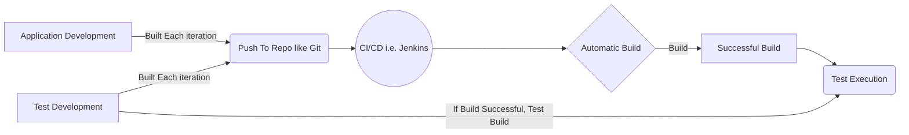

## MS BUILD
---
MS Build usually installed with the visual studio

 - Visual Studio MSBuild Location:   `C:\program files (x86)\ micrisoft visual studio\[date of build]\ [Version]\msbuild\[msbuild version]\bin`
 - Or: `c:\windows\microsoft.net\framework\[version]\msbuild.exe`

&nbsp;

## Jenkins Plugins
---
- MSBUILD : 
  1. Set MSBuild location to your environment variable
  2. Jenkins: Set MSBuild
  3. Use the solution name or project name in "MSBuild Build File"
  4. Additionally can add command line arguments  /p:Cofiguration=Debug /p:Platform:"ANY CPU" - Refer to the project build project configuration for list of options
  5. Build Locally and make  sure everything is fine before setting in Jenkins 
- NUnit
  1. Download and install NUnit Console on PC
  2. Run Nunit console and test 
  Example: `d:\Work\NUnit.org\nunit-console\nunit3-console.exe .\NUnitAutomationFramework.csproj`
  3. If Successful: Jenkins, After Build Add Batch /CMD and paste it there
  4. Add Post-build Actions
  5. Identify the file name 'TestResult.xml' this displays the Test Result Trend In Jenkins 
- Allure
  1. Download The latest Allure (current version 2.10) From [Allure](https://github.com/allure-framework/allure2/releases/)
  2. Configure The allure in your Jenkins allure i.e.: [Local Host](http://localhost:8080/configureTools/)
  
  3. Set the Test Report XML TestResult.xml
  

&nbsp;

## Usual Flow
---

&nbsp;

## Framework
---

### Configuration

 - Reading user defined configuration from `app.config` in `ConfigurationReader.cs` 

### IO
 - `FileAndFolder.cs` Execution directory and Project Directory
 - `SolutionFolders.cs` Enum For solution Folders

### ReflectionHandler
 -  `ObjectManipulator.cs` creating a dynamic object and can read properties and values

### SpreadSheet
- `SpreadsheetUtility.cs` Reading Data From Excel File

### WebPage
- `BrowserExtension.cs` Helper For Selenium Object Identification